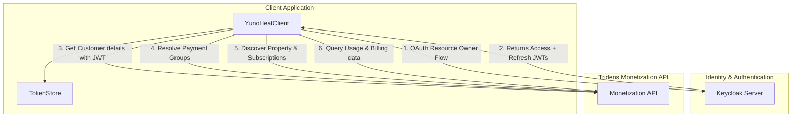
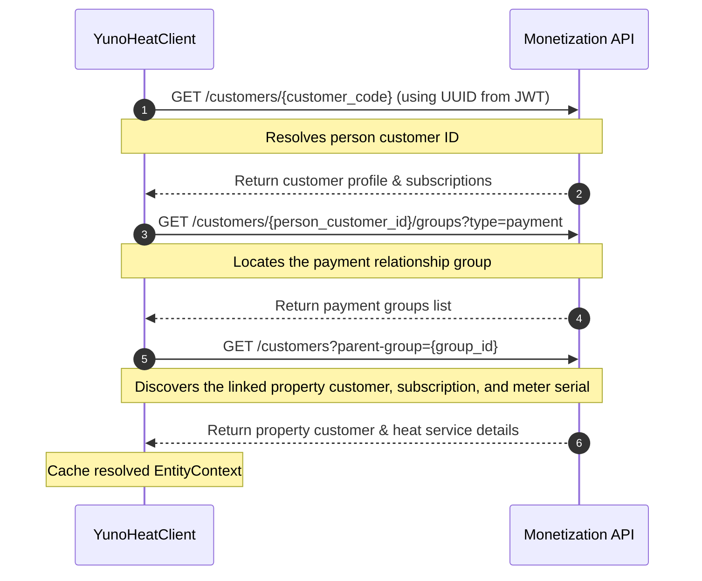

# Architecture Guide

This document explains the architecture of the **Yuno Energy Heat** API (formerly Kaizen Energy) and how the `pyyunoheat` library is designed to interact with it.

---

## System Overview

The Yuno Energy Heat backend runs on the **Tridens Monetization** platform. It consists of two major components:

1. **Keycloak Identity Provider**: Handles OAuth 2.0 / OpenID Connect authentication, realm administration, token signing, and refresh cycles.
2. **Monetization API**: Exposes endpoints for managing accounts, resolving property links, fetching invoices, and retrieving telemetry data.



---

## Authentication Mechanism

Authentication uses standard OpenID Connect (OIDC) against the `kaizen-energy-sandbox` Keycloak realm. The library uses the public client ID `mobile-yuno`.

### Realm Configurations

* **Issuer**: `https://app.tridenstechnology.com/auth/realms/kaizen-energy-sandbox`
* **Client ID**: `mobile-yuno`
* **Required Scopes**: `openid kaizen-energy`

### Token Lifecycle and Flow

1. **Token Grant**: The library performs authentication using the **Resource Owner Password Credentials** grant type. This direct grant exchanges the user's email and password for a set of JWT tokens without requiring browser redirection or webview wrappers.
2. **Access Token**: Valid for **30 minutes** (1800 seconds). Extracted claims include the customer's UUID and the parent site code.
3. **Refresh Token**: Valid for **35 minutes** (2100 seconds). The library automatically tracks the token expiration and submits a refresh grant type flow before making API calls.
4. **Token Storage**: Persisted tokens must store the raw access/refresh tokens alongside their absolute expiry timestamps to prevent unnecessary refresh requests.

---

## Customer and Entity Model

Tridens Monetization uses a two-tier hierarchy to manage accounts. This distinction is critical for querying usage telemetry correctly.

```
Person Customer (e.g. David Kernan, ID: 232971)
  │ (Main contact, receives invoices, owns billing profile)
  │
  └── Payment Group (ID: 32762)
        │ (Links the person customer to their physical home property)
        │
        └── Property Customer (e.g. Apt 020 Chambers Sq, ID: 201411)
              │ (Holds active service contracts and subscriptions)
              │
              └── Service (Heat Meter, ID: 8466, Serial: 04801107)
                    (Receives usage telemetry events)
```

### 1. Person Customer
This represents the human account holder.
* Authenticates to the system.
* Holds the parent subscription.
* Contains billing configuration, invoices, and credit balance information.

### 2. Property Customer
This represents the physical property location.
* Linked to the Person Customer via a **Payment Group**.
* Owns the heat meter subscription service.
* **CRITICAL**: Usage telemetry events (meter readings) are logged against the Property Customer, *not* the Person Customer.

---

## Bootstrap and Discovery Flow

When a client session begins (e.g., on first API call or manual startup), the client performs a bootstrap discovery sequence to map the entity ID graph. This caches the necessary identifiers to execute subsequent data calls quickly.



Once completed, the library caches the `EntityContext` (containing property customer ID, subscription ID, balance group ID, and meter identifier). If using a persistent integration like Home Assistant, you can serialize and cache this context to skip the 4-step bootstrap on restart.

---

## Telemetry Aggregation (Elasticsearch Query DSL)

The usage chart in the Yuno Energy user interface is powered by an Elasticsearch cluster. The API endpoint `/reports/usage` takes raw Elasticsearch Query DSL payloads to calculate sums and aggregations.

### Query Aggregation Logic

The library translates user queries into an Elasticsearch JSON body filtering on:
1. `service_type` matching `HEAT_METER_READ_SERVICE`.
2. `customer_id` matching the property customer's ID.
3. `resource_name` filtering for both `Euro` (monetary cost) and `Heat - Meter Value` (kWh consumption).

It requests a nested date histogram matching the specified interval (`day`, `week`, `month`, etc.), grouping the values into buckets:
* **Euro**: Sum of `amount` per interval.
* **Heat - Meter Value**: Sum of `quantity` per interval.

---

## Billing and Tariffs

Pricing is composed of two primary dimensions (based on telemetry observations):
1. **Consumption Charge**: A flat usage rate per kilowatt-hour of heat consumed (e.g., **€0.124/kWh**).
2. **Standing Charge**: A flat daily maintenance fee (e.g., **€0.686/day**).

This standing charge explains why a reading showing 1 kWh of consumption may cost €0.810 (0.124 usage + 0.686 standing charge). Invoices are periodically generated by the monetization platform and can be fetched via the `/invoices` API endpoint.
